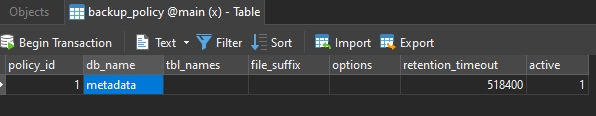

# Easy MySQLDump

A logical backup utility for MySQL, in its heart leveraging mysqldump program to do its heavy lifting. Shipped with simple backup retention system.

This tool is designed to support cronjob. Need >= Python 3.8

# Prerequisites

This utility uses small SQLite3 database to keep track its backup log and retention tracking that can be configured according to its policy.

This database is located in `data/metadata.db` after installation. To setup and migrate this database, use `install.sh`

```sh
# install.sh both metadata.db and settings.db
# Run this command for initial installation

./install.sh

# Install only metadata.db
./install.sh db

# Install only settings.py
./install.sh settings
```

# Application Settings

Currently the tool only supports single connection to local MySQL instance installed in the same machine, remote database backup is planned for future feature, to configure database connection credential, change the value inside `settings.py` to reflect your configuration.

```python3
DBPATH = './data/metadata.db'
TARGET = '/home/user/mysql_backup'

MYSQL_HOSTNAME = 'localhost'
MYSQL_PORT = '3306'
MYSQL_USERNAME = '<YOUR_USERNAME_HERE>'
MYSQL_PASSWORD = '<YOUR_PASSWORD_HERE>'
```

# Backup Policy Configuration

Backup policy need to be defined to select which database need to be backed up and what options and retention timeout for its backup. To do that policy need to be defined inside `data/metadata.db`

```sh
# Quickstart

sqlite3 -line data/metadata.db 'INSERT INTO backup_policy(db_name) VALUES(database_name)'

# Example
sqlite3 -line data/metadata.db 'INSERT INTO backup_policy(db_name) VALUES("mysql")'
```

Web interface to manage backup polices had been planned for future development. For now you can use another database explorer such as Navicat / TablePlus for easier policies configuration.



## Available Configurations

Backup policy configuration supports all parameters from `mysqldump` program. See all supported options, refer to `man mysqldump`

1. `db_name` -- Database name
2. `tbl_names` -- Table names (if available, left it empty for full database backup)
3. `file_suffix` -- Generated backup file suffix 
4. `options` -- mysqldump-supported options.
5. `retention_timeout` -- Retention timeout, in seconds (Default: 6 days / 518400 seconds)
6. `active` -- Backup policy activation flag (set to false to pause policy)

# Cron configuration

The backup retention system rely on cron to run script periodically, each time cronjob.py script is run, it performs backup and expiration routine.

Example Cron configuration

```
0 1 * * * /usr/bin/python3.9 /home/user/.easy-mysqldump/cronjob.py
0 7 * * * /usr/bin/python3.9 /home/user/.easy-mysqldump/cronjob.py
0 13 * * * /usr/bin/python3.9 /home/user/.easy-mysqldump/cronjob.py
```

To easily determine cron schedule you want to run, use online tool like https://crontab.guru/
